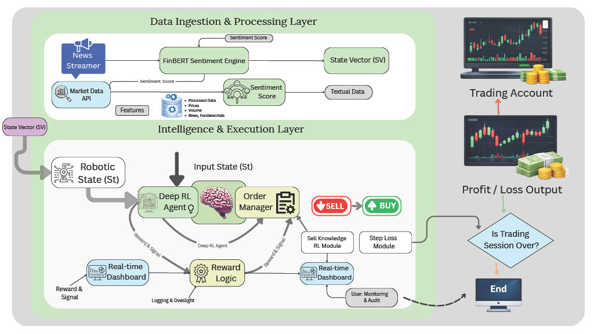

# Sentimental-Alpha: AI-Powered Trading Research Terminal

Sentimental-Alpha is an advanced trading research platform that combines **Reinforcement Learning (RL)** with **NLP-based Sentiment Analysis** to predict market movements. It utilizes financial news sentiment and technical indicators to train a trading agent.

## 🚀 Project Overview
The project is currently in **v0.6-Alpha**. It uses a PPO (Proximal Policy Optimization) agent trained on historical market data and real-time sentiment scores derived from **Yahoo Finance** news headlines.

### Core Technologies
- **Brain:** [Stable Baselines 3](https://stable-baselines3.readthedocs.io/) (PPO Algorithm)
- **Sentiment:** [FinBERT](https://huggingface.co/ProsusAI/finbert) (Financial BERT model)
- **Data:** [yfinance](https://github.com/ranaroussi/yfinance) for live prices and news (No API Key Required)
- **UI:** [Streamlit](https://streamlit.io/) for the research dashboard
- **Technicals:** RSI (Wilder's Smoothing), EMA, Volatility MA

---

## 📂 Project Structure

### Architecture Diagram


- `main.py`: **The Command Center.** Manage training, backtesting, and the dashboard from a single menu.
- `engine.py`: Core data engine. Handles fetching market data and manual technical indicator calculation.
- `trading_env.py`: Custom OpenAI Gymnasium environment for the RL agent.
- `run_sentiment.py`: Sentiment engine using FinBERT and yfinance news.
- `main_app.py`: Training script for the PPO model.
- `test_agent.py`: Backtesting script to generate latest dashboard data.
- `dashboard.py`: Streamlit-based UI for visualizing market data and AI predictions.

---

## 🛠️ Setup & Installation

1. **Clone the Repo:**
   ```bash
   git clone <your-repo-url>
   cd Sentimental-Alpha
   ```

2. **Environment Setup:**
   - Create a virtual environment: `python -m venv venv`
   - Activate it: `venv\Scripts\activate` (Windows) or `source venv/bin/activate` (Mac/Linux)

3. **Install Dependencies:**
   ```bash
   pip install -r requirements.txt
   ```

---

## 🏃‍♂️ How to Run (Single Terminal)

The easiest way to run the project is via the Command Center:

```bash
python main.py
```

From the menu, you can:
1. **Train** a new model (Option 1).
2. **Backtest** the latest results (Option 2).
3. **Launch the Dashboard** (Option 3).
4. **Quick Start** (Option 4): Runs backtest and launches dashboard automatically.

---

## 📈 Current Status
- ✅ **Free News Integration:** No API keys needed (Yahoo Finance).
- ✅ **Robust Indicators:** Manual implementation of Wilder's RSI and EMA.
- ✅ **Unified UI:** Central command center for easy management.
- ✅ **Optimized Dashboard:** Visualizes AI signals and backtest P/L in real-time.

---

## 📝 License
MIT License - Feel free to use and extend!
